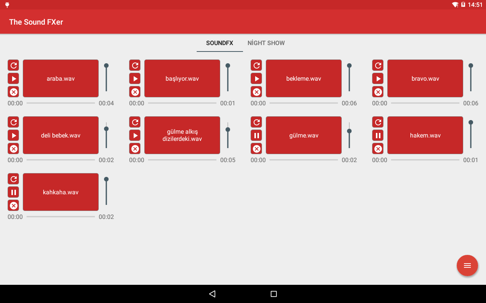
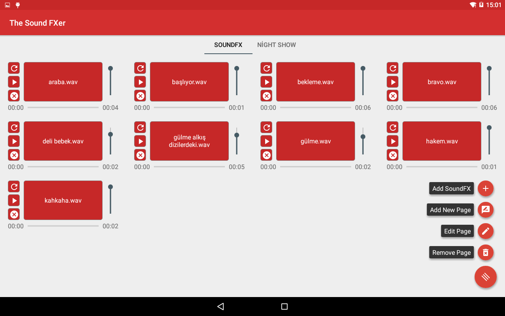

# the-sound-fxer
An Android Sound FX pad application created for radio hosts

## Usage
Just download the source code and install it to your target device. This application is optimized for tablets only so please do not try to run on phones. Also I'm too lazy to optimize it for phones too.

`git clone https://github.com/umitemre/the-sound-fxer.git`

or, you can directly download `app-debug.apk` from [here](app-debug.apk).

## Features
- Multi tabs: You can create more than one page and divide your Sound FXes into groups.
- Volume: You can adjust volumes of sound FXes individually.
- Easy to use: Sound FXes start playing by tapping directly on the items and pause it on second tap.
- File support: I'm not quite sure which media types are supported but it supports all files that MediaPlayer of Android supports. You can see the whole list from [here](https://developer.android.com/guide/topics/media/media-formats#audio-formats).

## Screenshots

